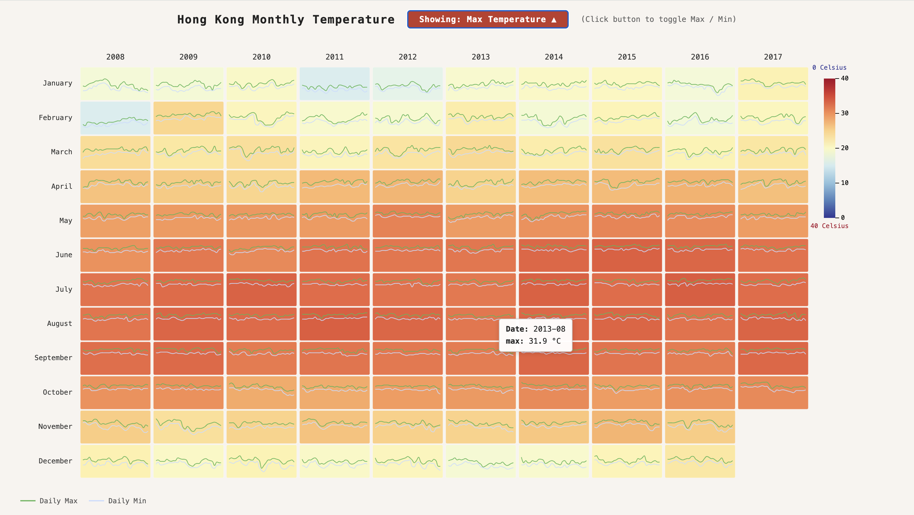
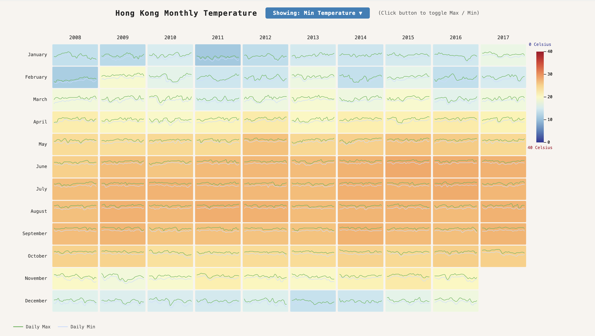

# 🌡️ Hong Kong Monthly Temperature Matrix

A Matrix View visualization of Hong Kong's daily temperature data built with **React** and **D3.js**.

---

## 📸 Preview

### Max Temperature View


### Min Temperature View


---

## 🛠️ Tech Stack

| Tool | Purpose |
|------|---------|
| [React](https://react.dev/) | UI framework |
| [D3.js](https://d3js.org/) | Data visualization |
| [Vite](https://vitejs.dev/) | Build tool & dev server |

---

## 📁 Project Structure

```
hongkong-temp-matrix/
├── public/
│   └── temperature_daily.csv     # Raw temperature dataset (1997–2017)
├── src/
│   ├── App.jsx                   # Main component — all visualization logic lives here
│   ├── main.jsx                  # React entry point
│   └── assets/
│       ├── preview.png           # Screenshot: Max temperature view
│       └── preview1.png          # Screenshot: Min temperature view
├── index.css                     # Global CSS reset 
├── index.html
├── package.json
└── README.md
```

---

## 🚀 Getting Started

### Prerequisites

Make sure you have the following installed:
- [Node.js](https://nodejs.org/) (v16 or higher)
- npm (comes with Node.js)

Check your versions:
```bash
node -v
npm -v
```

---

### Installation & Setup

**1. Clone the repository**
```bash
git clone https://github.com/YOUR_USERNAME/hongkong-temp-matrix.git
cd hongkong-temp-matrix
```

**2. Install dependencies**
```bash
npm install
```

**3. Install D3.js** (if not already in package.json)
```bash
npm install d3
```

**4. Run the development server**
```bash
npm run dev
```

**5. Open in browser**
```
http://localhost:5173
```

---

## 📊 Dataset

- **File:** `public/temperature_daily.csv`
- **Source:** Hong Kong Observatory daily temperature records
- **Range:** 1997–2017 (visualization focuses on last 10 years: 2008–2017)
- **Columns:**

  | Column | Description |
  |--------|-------------|
  | `date` | Date in `YYYY-MM-DD` format |
  | `max_temperature` | Daily maximum temperature (°C) |
  | `min_temperature` | Daily minimum temperature (°C) |

---

## ✨ Features

| Feature | Description |
|---------|-------------|
| **Matrix Layout** | X-axis = Year, Y-axis = Month (last 10 years) |
| **Color Encoding** | Blue (0°C) → Yellow → Orange → Dark Red (40°C) |
| **Toggle Max/Min** | Click the button in the header to switch between views |
| **Tooltip** | Hover over any cell to see the date and peak temperature value |
| **Mini Line Charts** | Green line = daily max, Light blue = daily min per cell |
| **Color Legend** | Gradient bar on the right maps colors to °C values (0–40) |
| **Responsive** | SVG auto-resizes to fill the browser window via ResizeObserver |

---

## 🧱 Code Architecture

All visualization logic is in `src/App.jsx`, split into clearly named, single-responsibility functions:

```
── Data Helpers ──────────────────────────────────────────
parseRows()       → Parses raw CSV strings into typed JS objects
buildGrouped()    → Filters last 10 years, groups by year → month → day[]
buildCells()      → Builds flat cell array with absMax / absMin per month

── Drawing Functions ─────────────────────────────────────
drawAxes()        → Renders year labels (top) and month labels (left)
drawLegend()      → Renders the color gradient legend on the right
drawMiniChart()   → Draws daily max/min line chart inside each cell
drawMatrix()      → Orchestrates the full SVG render (calls all above)

── React Component ───────────────────────────────────────
App()             → Manages state, loads CSV, wires D3 to DOM via refs
```

---
